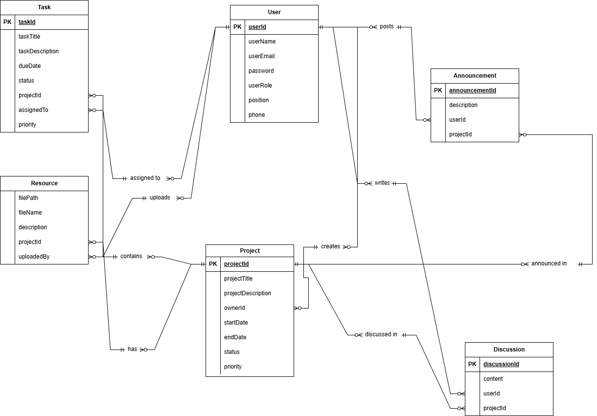

<h1 align="center">KULLIYYAH OF INFORMATION AND COMMUNICATION TECHNOLOGY</h1>
<h1 align="center">INFO 3305 WEB APPLICATION DEVELOPMENT</h1>
<h2 align="center">SEMESTER 1 2025/2026</h2>
<h2 align="center">SECTION 5</h2>

<!-- 

 -->

# KerjaMudah

# KerjaMudah - Management: KerjaMudah - Employees Collaboration Portal

## Group Information

**Group Name**: W-hackers
**Section**: 5

**Group Members** :
- Aiman bin Ahmad Zainulkamal - 2311929
- Muhammad Aiman Haziq bin Razali - 2312039
- Mohammad Zaimmudin bin Zaidi - 2319523
- Aris Syazwan bin Zainul Aman  - 2313947

## Project Overview

Introduction :
KerjaMudah a modern, web-based collaboration platform developed to help organizations and institutions manage projects and teamwork more efficiently. The platform provides a centralized digital workspace where teams can collaborate, communicate, share resources, and manage tasks seamlessly. By integrating project management, resource sharing, and communication tools into a single system, KerjaMudah minimizes workflow disruptions, improves productivity, and enhances team coordination. Designed with simplicity and scalability in mind, KerjaMudah supports organizations in streamlining operations, improving collaboration efficiency, and achieving better project outcomes.

## Project Objectives

The primary objective of KerjaMudah is to deliver a centralized collaboration platform that enhances teamwork and project coordination within organizations. It aims to improve communication and transparency among team members through structured task management and discussion tools. KerjaMudah also seeks to simplify the sharing, organization, and accessibility of project-related resources. Additionally, the platform is designed to optimize time management, reduce operational inefficiencies, and support organizations in delivering projects more effectively, on time, and within scope.

## Target Users

KerjaMudah is designed to serve a wide range of users who require effective collaboration and project management in a digital environment. The primary target users include:

Small and Medium Enterprises (SMEs)
SMEs that manage multiple projects and teams can use KerjaMudah to coordinate tasks, track progress, and improve internal communication without relying on multiple disconnected tools.

Educational Institutions
Lecturers, students, and academic project teams can utilize KerjaMudah to manage group assignments, share learning resources, discuss project requirements, and monitor task completion efficiently.

Corporate Project Teams
Organizations with cross-functional teams can use the platform to assign responsibilities, manage deadlines, and ensure transparency across departments.

## Features and Functionalities

- User Management : Users can register, log in, and manage their profiles securely, with role-based access to ensure proper project control.

- Project Management  : Create, update, and manage projects efficiently, allowing teams to track progress and maintain clear ownership.

- Task Assignment : Assign tasks to team members with defined deadlines, priorities, and real-time status updates to ensure accountability.

- Resource Sharing : Upload, organize, and manage project-related files such as documents, links, and reference materials in a centralized repository.

- Discussion Threads : Engage in structured discussions through comment threads within each project to ensure clear communication and reduced misinterpretation. 

## Technical Implementation

** Technology Stack**

- Backend Framework: Laravel 10.x
- Frontend: Blade Templates with Bootstrap 5
- Database: MySQL 8.0
- Authentication: Laravel Breeze
- Image Storage: Laravel File Storage
- Development Environment: XAMPP

** Database Design**

<!-- Database Schema Overview
Our database consists of [X] main tables designed to handle users, restaurants, menus, orders, and related data:
Core Tables:

- users - Customer and restaurant owner accounts
- restaurants - Restaurant information and details
- menu_items - Food items with pricing and descriptions
- orders - Customer order records
- order_items - Individual items within each order
- categories - Food categories for menu organization -->

### Entity Relationship Diagram (ERD)

  

Key Relationships:

1. User ↔ Project
Relationship: One-to-Many
Primary Key (PK):
User.user_id
Foreign Key (FK):
Project.owner_id → references User.user_id
Explanation:
One user can create/own many projects, but each project is owned by only one user.

2. Project ↔ Task
Relationship: One-to-Many
Primary Key (PK):
Project.project_id
Foreign Key (FK):
Task.project_id → references Project.project_id
Explanation:
A project can have many tasks, but each task belongs to only one project.

3. User ↔ Task
Relationship: One-to-Many
Primary Key (PK):
User.user_id
Foreign Key (FK):
Task.assigned_to → references User.user_id
Explanation:
One user can be assigned many tasks, but each task is assigned to only one user.

4. Project ↔ Resource
Relationship: One-to-Many
Primary Key (PK):
Project.project_id
Foreign Key (FK):
Resource.project_id → references Project.project_id
Explanation:
A project can have many resources (files), but each resource belongs to one project.

5. User ↔ Resource
Relationship: One-to-Many
Primary Key (PK):
User.user_id
Foreign Key (FK):
Resource.uploadedBy → references User.user_id
Explanation:
A user can upload many resources, but each resource is uploaded by one user.

6. User ↔ Discussion
Relationship: One-to-Many
Primary Key (PK):
User.user_id
Foreign Key (FK):
Discussion.user_id → references User.user_id
Explanation:
A user can post many discussions, but each discussion is posted by one user.

7. Project ↔ Discussion
Relationship: One-to-Many
Primary Key (PK):
Project.project_id
Foreign Key (FK):
Discussion.project_id → references Project.project_id
Explanation:
A project can have many discussion messages, but each discussion belongs to one project.

8. User ↔ Announcement
Relationship: One-to-Many
Primary Key (PK):
User.user_id
Foreign Key (FK):
Announcement.user_id → references User.user_id
Explanation:
A user can create many announcements, but each announcement is created by one user.

9. Project ↔ Announcement
Relationship: One-to-Many
Primary Key (PK):
Project.project_id
Foreign Key (FK):
Announcement.project_id → references Project.project_id
Explanation:
A project can have many announcements, but each announcement belongs to one project.

** Laravel Components Implementation**

- Routes (Web.php)
  
<!-- php
`// Authentication Routes`
Auth::routes();

`// Public Routes`
Route::get('/', [HomeController::class, 'index'])->name('home');
Route::get('/restaurants', [RestaurantController::class, 'index'])->name('restaurants.index');
Route::get('/restaurants/{restaurant}', [RestaurantController::class, 'show'])->name('restaurants.show');

`// Customer Protected Routes`
Route::middleware(['auth', 'customer'])->group(function () {
    Route::get('/dashboard', [CustomerController::class, 'dashboard'])->name('customer.dashboard');
    Route::resource('orders', OrderController::class);
    Route::post('/cart/add', [CartController::class, 'add'])->name('cart.add');
});

`// Restaurant Owner Protected Routes`
Route::middleware(['auth', 'restaurant'])->group(function () {
    Route::get('/restaurant/dashboard', [RestaurantOwnerController::class, 'dashboard'])->name('restaurant.dashboard');
    Route::resource('menu-items', MenuItemController::class);
}); -->

- Controllers
  
  <!-- *Main Controllers Implemented are below :*

  1. HomeController: Handles homepage display and restaurant listings
  2. RestaurantController: Manages restaurant information and menu display
  3. OrderController: Processes order creation, tracking, and management
  4. MenuItemController: Handles CRUD operations for menu items
  5. CartController: Manages shopping cart functionality
  6. CustomerController: Customer dashboard and profile management
  7. RestaurantOwnerController: Restaurant owner dashboard and analytics -->

- Models and Relationships
  
<!-- php// User Model
class User extends Authenticatable {
    public function orders() {
        return $this->hasMany(Order::class);
    }
    
    public function restaurant() {
        return $this->hasOne(Restaurant::class);
    }
}

// Restaurant Model  
class Restaurant extends Model {
    public function user() {
        return $this->belongsTo(User::class);
    }
    
    public function menuItems() {
        return $this->hasMany(MenuItem::class);
    }
}

// Order Model
class Order extends Model {
    public function user() {
        return $this->belongsTo(User::class);
    }
    
    public function orderItems() {
        return $this->hasMany(OrderItem::class);
    }
} -->

- Views and User Interface

  <!-- *Blade Templates Structure:*
  - layouts/app.blade.php - Main application layout
  - home.blade.php - Homepage with restaurant listings
  - restaurants/index.blade.php - Restaurant browsing page
  - restaurants/show.blade.php - Individual restaurant menu
  - orders/create.blade.php - Order placement form
  - dashboard/customer.blade.php - Customer dashboard
  - dashboard/restaurant.blade.php - Restaurant owner dashboard

   *Design Features:*
   - Responsive Design: Bootstrap 5 for mobile-first approach
   - Color Scheme: Modern orange and white theme representing food industry
   - Navigation: Intuitive menu structure with user role-based options
   - Interactive Elements: Dynamic cart updates, real-time order tracking -->

## User Authentication System

### ** Authentication Features**
<!-- - **Registration System**: Email validation, password confirmation, role selection
- **Login System**: Secure authentication with "Remember Me" option
- **Password Reset**: Email-based password recovery system
- **Role-Based Access**: Different dashboards for customers and restaurant owners as admin
- **Profile Management**: Users can update their information and preferences

### **Security Measures**
- Password encryption using Laravel's built-in hashing
- CSRF protection on all forms
- Input validation and sanitization
- Middleware protection for authenticated routes -->

## Installation and Setup Instructions
### Prerequisites :
- PHP >= 8.1
- Composer
- Node.js and NPM
- MySQL 8.0
- XAMPP 

### Step-by-Step Installation

1. Clone the Repository

bash/n
git clone https://github.com/ayr132/wad-kerjamudah.git/n
cd QuickPlate

2. Install Dependencies

bashcomposer install
npm install

3. Environment Configuration

bashcp .env.example .env
php artisan key:generate

4. Database Setup

bash# Configure database in .env file
php artisan migrate
php artisan db:seed

5. Start Development Server

bashphp artisan serve
npm run dev

## Testing and Quality Assurance

###  Functionality Testing

 <!-- - User registration and login system
 - Restaurant browsing and menu display
 - Shopping cart add/remove functionality
 - Order placement and confirmation
 - Order status tracking
 - Restaurant owner menu management
 - Admin user management
 - Responsive design across devices -->

### Browser Compatibility

<!-- -  Google Chrome (Latest)
-  Mozilla Firefox (Latest)
-  Safari (Latest)
-  Microsoft Edge (Latest) -->

### Performance Testing

<!-- - Page load times under 3 seconds
- Database queries optimized
- Image compression implemented
- Responsive design tested on multiple screen sizes -->

## Challenges Faced and Solutions
### Challenge 1: Complex Order Management
- Problem: Managing relationships between orders, order items, and menu items
- Solution: Implemented proper Eloquent relationships and created pivot tables for many-to-many relationships
### Challenge 2: Real-time Order Tracking
- Problem: Updating order status in real-time without page refresh
- Solution: Used AJAX calls to update order status dynamically
### Challenge 3: Role-based Authentication
- Problem: Different user types requiring different access levels
- Solution: Implemented middleware to check user roles and redirect appropriately

## Future Enhancements
- **Real-time Notifications** : Instant alerts for task updates and announcements
- **File Version Control** : Track changes and revisions in shared resources
- **User Activity Logs** : Monitor user actions for better accountability
- **Advanced Reporting** : Project progress reports and performance analytics
- **Calendar Integration** : Task deadlines synced with calendar systems
- **Mobile Application** : Dedicated mobile app for easier access and collaboration

### Scalability Considerations

- Database optimization for larger datasets
- Caching implementation for improved performance
- API development for mobile app integration
- Load balancing for high traffic scenarios

## Learning Outcomes
### Technical Skills Gained

- Laravel Framework: Understanding of MVC architecture and Eloquent ORM
- Database Design: Creating efficient database schemas and relationships
- Authentication: Implementing secure user authentication systems
- Frontend Development: Building responsive interfaces with Bootstrap
- Version Control: Using Git and GitHub for project management -->

### Soft Skills Developed

- **Team Collaboration** : Working effectively in a group environment
- **Project Management** : Planning and executing a complex web application
- **Problem Solving** : Debugging and resolving technical challenges
- **Documentation** : Creating comprehensive project documentation 

## References

1. Kendall, K. E., & Kendall, J. E. (2019). Systems Analysis and Design (10th ed.). Pearson Education.
2. Connolly, T., & Begg, C. (2015). Database Systems: A Practical Approach to Design, Implementation, and Management (6th ed.). Pearson Education.
3. Sommerville, I. (2016). Software Engineering (10th ed.). Pearson Education.
4. W3Schools. (2024). Web Development Tutorials. Retrieved from https://www.w3schools.com
5. Lucid Software. (2024). Entity Relationship Diagram (ERD) Guide. Retrieved from https://www.lucidchart.com

## Conclusion
In conclusion, the KerjaMudah project provides an effective solution for managing projects and team collaboration in a centralized platform. The system design successfully addresses common challenges such as task coordination, communication, and resource sharing by integrating all essential features into one system. Through careful planning and structured database design, the project demonstrates a strong understanding of system analysis principles and serves as a solid foundation for future system development and improvements.

### Key Achievements

- Successfully designed a centralized project management system that integrates tasks, resources, discussions, and announcements.
- Developed a clear and structured ERD with well-defined relationships between User, Project, Task, Resource, Discussion, and Announcement entities.
- Ensured proper task assignment and project ownership to improve accountability and workflow management.
- Designed features that support effective team communication through discussions and announcements within each project.
- Enhanced understanding of system analysis, database design, and teamwork throughout the project development process.
  
### Project Impact
This project provides practical experience in building real-world web applications and demonstrates the ability to work collaboratively in a team environment. The skills gained through this project are directly applicable to professional web development scenarios. 

- Project Completion Date: 11/6/2025
- Course: INFO 3305 Web Application Development
